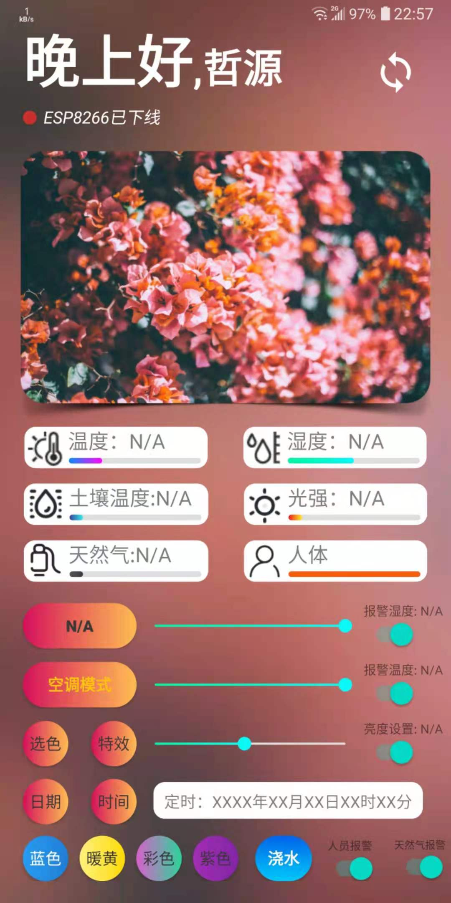
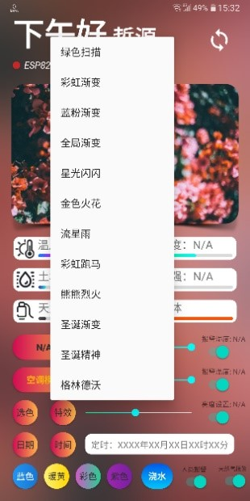
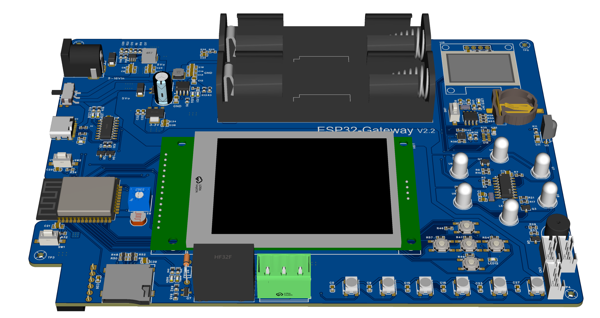
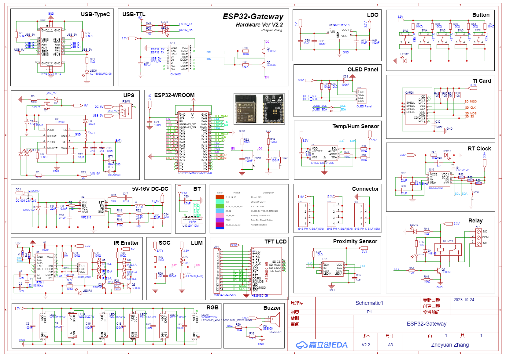
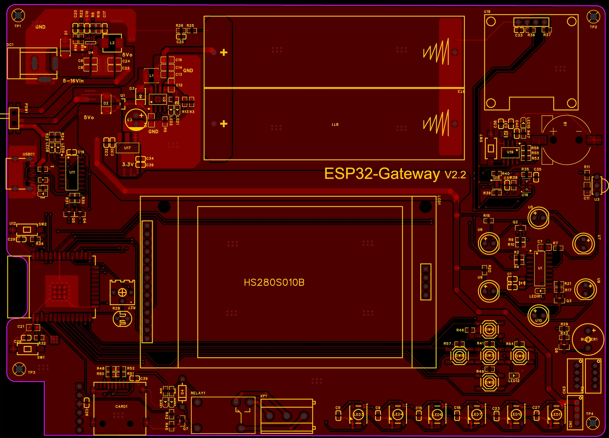
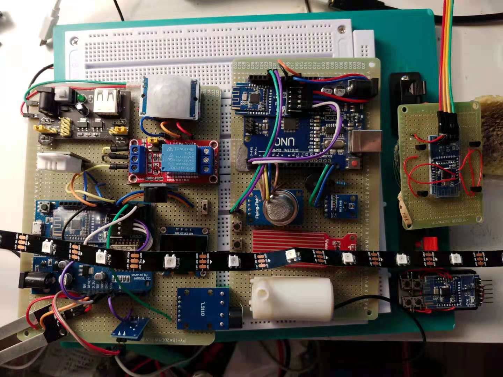
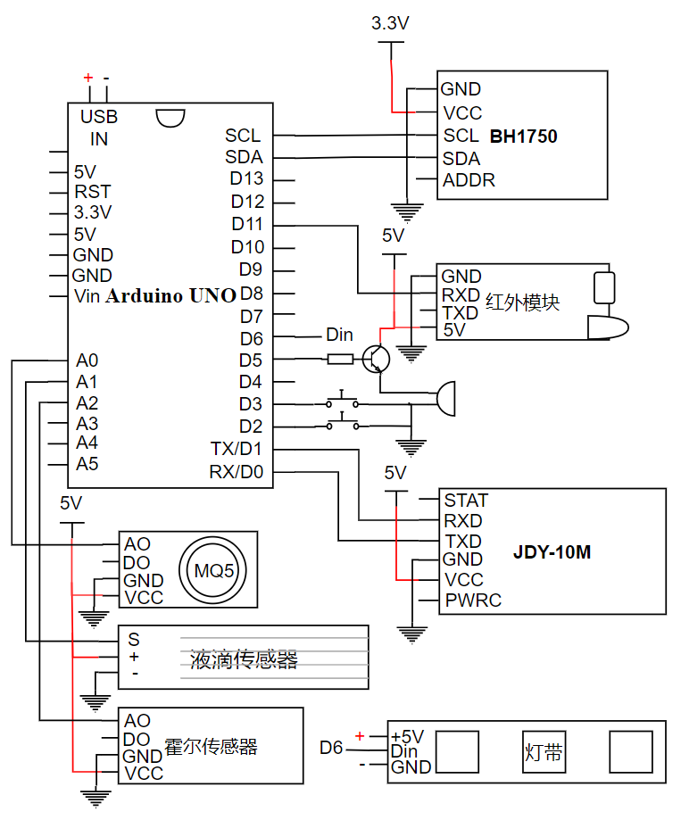
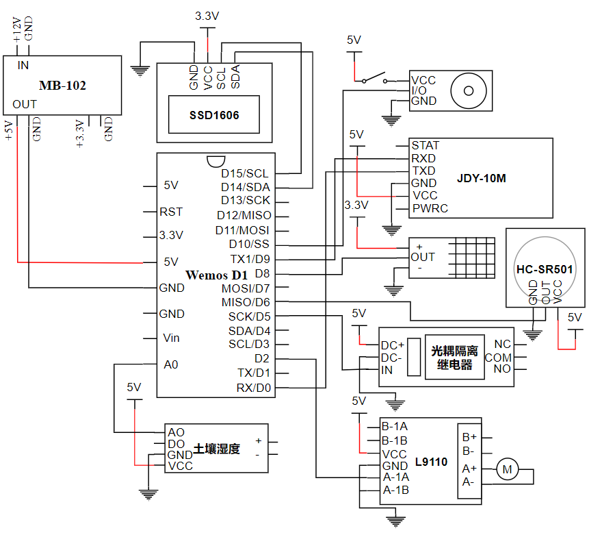

# Joy's Smart Home Collection V2

Welcome to my personal smart home project repository. This repository contains a collection of code, hardware schematics, and UI designs I have been working on to create a smart home environment that suits my needs. The project is started as my undergraduate thesis project and is designed to keep growing and integrating with various smart devices to provide an unique and seamless experience.

> **Note:** I don't have much time to write usage instructions for this project recently, so it's just a collection of files for now. If you have some previous experience, you can try to figure it out by yourself.  Or if you are interested in any specific part of the project, please let me know and I will try to write some instructions for you.

## Table of Contents

- [Overview](#overview)
- [Project Structure](#project-structure)
- [Showcase](#showcase)
- [License](#license)

## Overview

This project is an initiative to automate and control various aspects of a home environment using IoT technology. This includes lighting, security, climate control, and more. The project leverages IoT protocols, microcontrollers, and custom software to create an unique smart home system.

- Most of the mcu code are written in C and C++ and are designed to build with ESP-IDF on ESP32 platform.
- Hardware schematics are designed with JLCPCB.
- Homeassistant components are built with python.
- Homeassistant lovelace dashboard cards are built with css and node-js

## Project Structure

The repository is organized into several components, each responsible for different functionalities:

- **1.0**: Original version of the project.

- **2.0**: Contains the source code for New ESP32-Gateway(Master) firmware based on ESP-IDF.
  - `main`: Main entry of the project, including wifi manager, ws server, esp-now manager and ota manager.
  - `components/ble-client`: Basic BLE client implementation(Master).
  - `components/ble-server`: Basic BLE server setup(Slave).
  - `components/ble-mesh-client`: BLE Mesh client implementation.(Client)
  - `components/ble-mesh-server-1`: BLE Mesh server implementation.(Master)
  - `components/dns-server`: DNS server implementation.(Master)

- **Hardware Schematics**: Includes circuit diagrams and hardware setup instructions.

- **Homeassistant**: Contains homeassistant files.
  - `Components`: Custom components for the Homeassistant (python).
  - `Configs/custom_cards`: Homeassistant ui-minimalist card configs (css/yaml).
  - `Configs/dashboard`: Homeassistant dashboard configs (yaml). 
  - `Lovelace cards`: Homeassistant custom lovelace cards (html/css/js).
  - `Themes`: Homeassistant custom themes (css/yaml).

- **UI Designs**: Contains screenshots for the user interface of the smart home control system (App/Web).

## Showcase

### Web UI (2.0)

UI Showcase featured by YT "Everything Smart Home" Channel
<iframe width="560" height="315" src="https://www.youtube.com/embed/HYmtGLPDdkk?si=O_IT3RxZfcszkRrI" frameborder="0" allow="accelerometer; autoplay; clipboard-write; encrypted-media; gyroscope; picture-in-picture" allowfullscreen></iframe>

    
    

### App UI (1.0)
<iframe width="560" height="315" src="//player.bilibili.com/player.html?isOutside=true&aid=501380034&bvid=BV1FN411o7tJ&cid=291187473&p=1" scrolling="no" border="0" frameborder="no" framespacing="0" allowfullscreen="true"></iframe>

### Schematics (2.0)

### Schematics (1.0)

## License

This project is licensed under the Apache-2.0 License. See the [LICENSE](LICENSE) file for details.

